# [MusicForum]

## 👥 Miembros del Equipo
| Nombre y Apellidos | Correo URJC | Usuario GitHub |
|:--- |:--- |:--- |
| Carlos Moreno Cano | c.morenoc.2022@alumnos.urjc.es | roomtrash6 |
| Lorena López Gallego-Casilda | l.lopezga.2023@alumnos.urjc.es | msbuns01 |
| Óscar Rodríguez Pérez | o.rodriguez.2022@alumnos.urjc.es | OscarRP15 |


---

## 🎭 **Preparación: Definición del Proyecto**

### **Descripción del Tema**
Es una aplicación web tipo foro para que los amantes de la música compartan sus opiniones y debatan con otros usuarios sobre nuevos lanzamientos, sus artistas favoritos, etc... 
El objetivo de la aplicación es crear un ambiente acogedor y respetuoso en el que los usuarios se sientan cómodos escribiendo sobre música.

### **Entidades**
Indicar las entidades principales que gestionará la aplicación y las relaciones entre ellas:

1. **[Entidad 1]**: Usuario
2. **[Entidad 2]**: Post
3. **[Entidad 3]**: Comentario
4. **[Entidad 4]**: Álbum


**Relaciones entre entidades:**
- Usuario - Post: Un usuario puede tener múltiples posts pero la autoría de un post no puede ser de varios usuarios simultáneamente (1:N).
- Usuario - Comentario: Un usuario puede escribir varios comentarios pero un comentario no puede ser de varios usuarios (1:N).
- Post - Comentario: Un post puede contener múltiples comentarios pero un comentario no puede pertenecer a más de un post (1:N).
- Post - Álbum: Un post puede tratar de varios álbumes y un álbum puede estar etiquetado en varios posts (N:M)

### **Permisos de los Usuarios**
Describir los permisos de cada tipo de usuario e indicar de qué entidades es dueño:

* **Usuario Anónimo**: 
  - Permisos: Visualización del contenido de otros usuarios.
  - No es dueño de ninguna entidad

* **Usuario Registrado**: 
  - Permisos: Creación de posts bajo su nombre, creación de comentarios bajo su nombre, valoración del contenido de otros usuarios, edición de su perfil público.
  - Es dueño de: Sus posts y sus comentarios.

* **Administrador**: 
  - Permisos: Tiene permisos de creación, edición, y borrado de todas las entidades de la web. Esto incluye todos los posts y comentarios de todos los usuarios, y todos los títulos de música que se pueden discutir en la página.
  - Es dueño de: Es dueño de todas las entidades de la web.

### **Imágenes**
Indicar qué entidades tendrán asociadas una o varias imágenes:

- **[Entidad con imágenes 1]**: Usuario
- **[Entidad con imágenes 2]**: Álbum
- **[Entidad con imágenes 3]**: Post


---

## 🛠 **Práctica 1: Maquetación de páginas con HTML y CSS**

### **Vídeo de Demostración**
📹 **[Enlace al vídeo en YouTube](https://www.youtube.com/watch?v=x91MPoITQ3I)**
> Vídeo mostrando las principales funcionalidades de la aplicación web.

### **Diagrama de Navegación**
Diagrama que muestra cómo se navega entre las diferentes páginas de la aplicación:

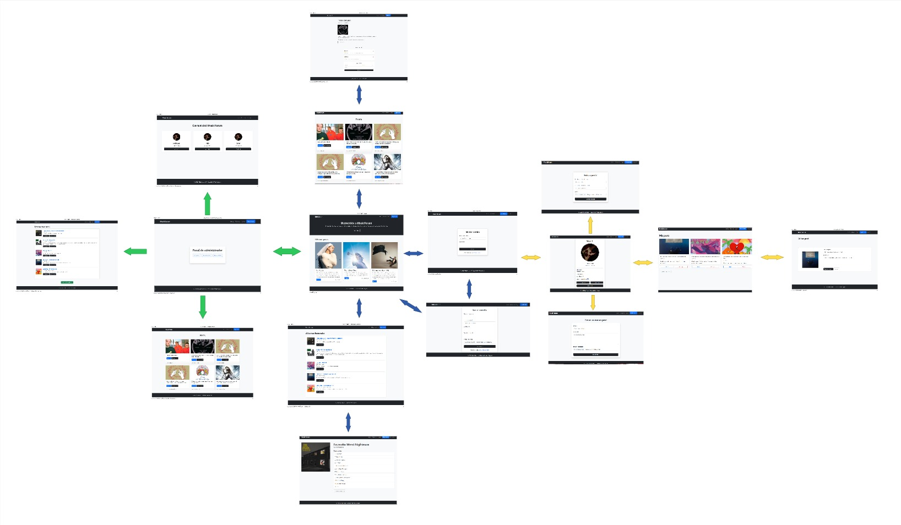

> [Descripción opcional del flujo de navegación: Ej: "El usuario puede acceder desde la página principal a todas las secciones mediante el menú de navegación. Los usuarios anónimos solo tienen acceso a las páginas públicas, mientras que los registrados pueden acceder a su perfil y panel de usuario."]

### **Capturas de Pantalla y Descripción de Páginas**

#### **1. Página Principal / Inicio**
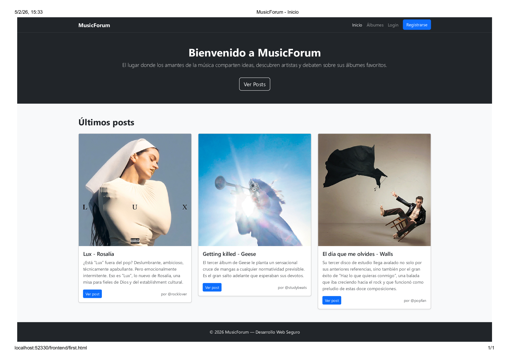

> La página principal muestra los post más destacados del foro e incluye un botón para acceder al resto de los posts. Incluye barra de navegación, la cual da acceso a: inicio, álbumes, registro de usuario e inicio de sesión. Nota: esta barra de navegación está presente en todas las páginas.

#### **2. Página Posts Publicados/ Listado de Posts**
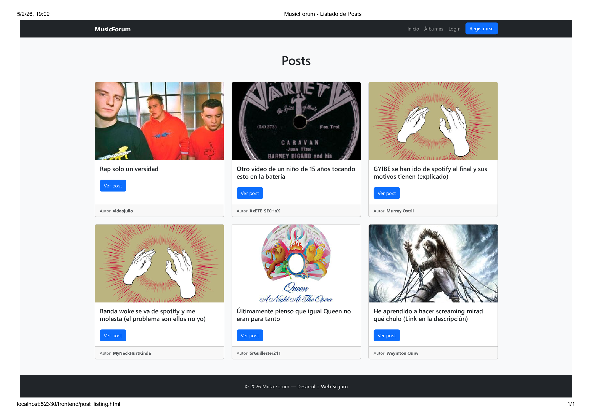
> Esta página muestra un listado de los post publicados. Incluye un botón para ver el post completo y sus comentarios.

#### **3. Página Ver Post / Post**
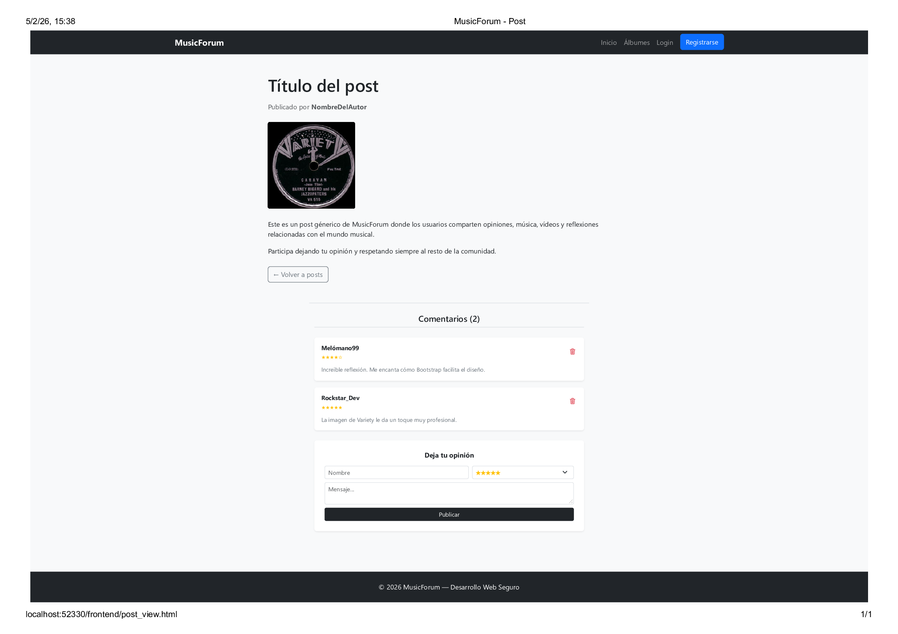
>Esta página es una página genérica para todos los posts, la cual incluye: el post completo, los comentarios ya publicados, un botón para volver a la página de posts publicados y un formulario para dejar una opinión.

#### **4. Página Álbumes/ Listado de Álbumes**
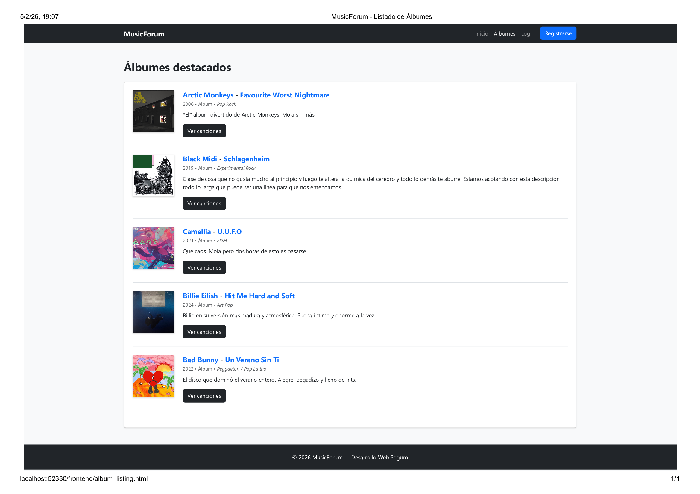
> Esta página muestra una lista de los álbumes disponibles en el foro. Se incluye un botón para ver el listado de canciones de cada álbum.

#### **5. Página Lista Canciones Álbum / Álbum**

> Esta página muestra las canciones que componen el albúm seleccionado, además de la portada y un botón para volver a la lista de álbumes.

#### **6. Página de Login / Login**
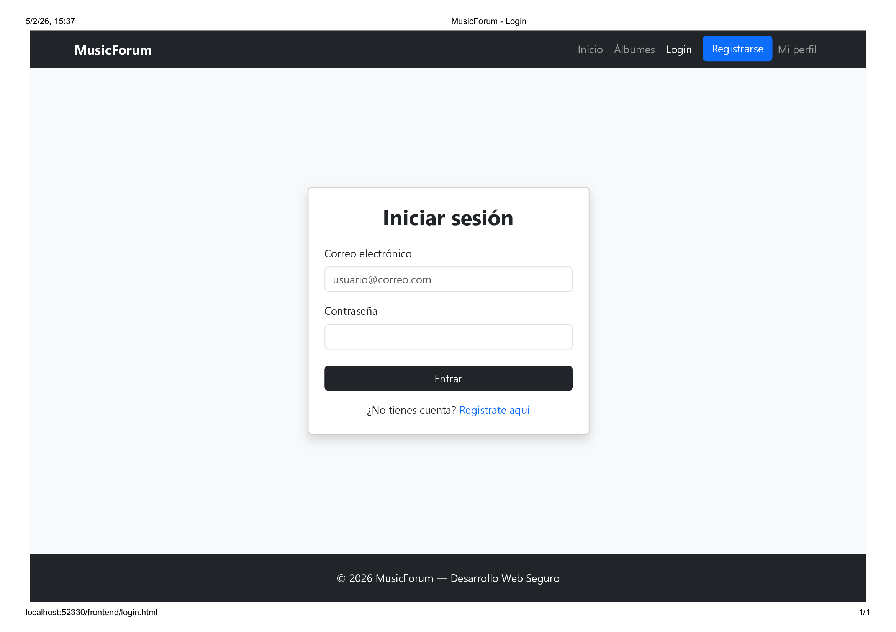
> Esta página muestra un formulario para que cada usuario inicie sesión en su cuenta. En caso de no estar regstrado, se incluye un botón que le redirijirá a la página de registro. Como todavía no está implementada una funcionalidad real, se ha incluido en la barra de navegación un acceso a la página "Mi Perfil" para simular que, solo aquel usuario registrado, tiene acceso a esta.

#### **7. Página de Registro/ Registro**

> Esta página muestra un formulario para que cada usuario cree una cuenta en el foro. En caso de ya tener cuenta, se incluye un botó que le redirijirá a la página de login.

#### **8. Página Perfil de Usuario / Mi perfil**
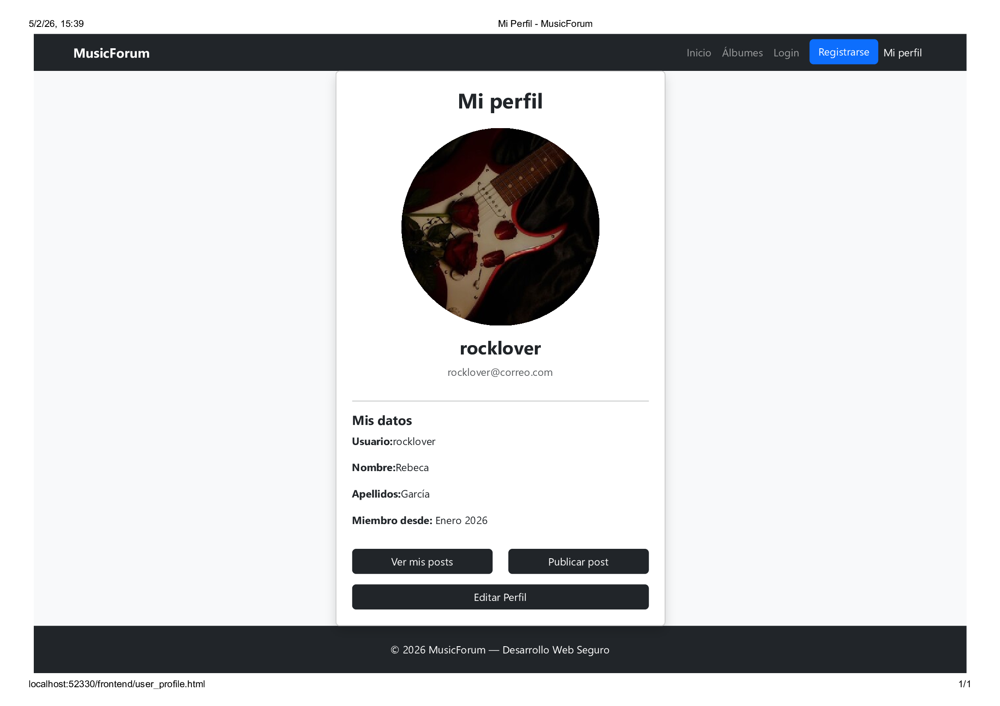
> Esta página incluye la información del perfil de un usuario (nombre, apellidos, nombre de usuario, miembro desde:, avatar). Se incluyen botones para ver los post propios del usuario, publicar un post y editar el perfil.

#### **9. Página Ver Mis Posts / Mis Post**
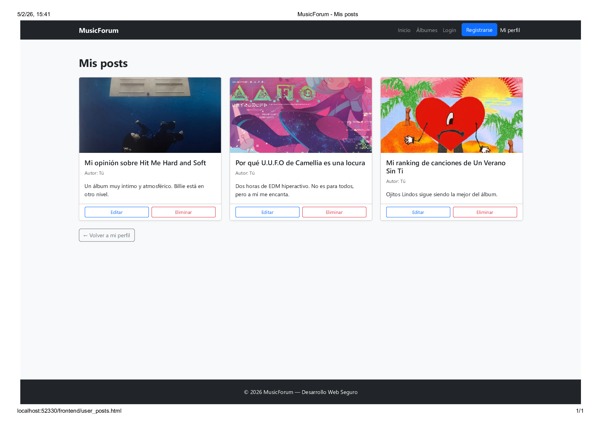
> Esta página incluye un lista de los post que ha publicado el usuario registrado. En cada post aparecen dos botones, uno para editar el post y otro para eliminarlo. También muestra un botón para volver a la página del perfil.

#### **10. Página Ver Todos Los Usuarios / Listado de usuarios**
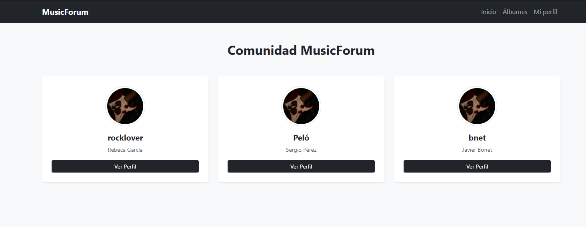
> Esta página sólo es accesible para el administrador de la página web. Desde ahí podrá ver los usuarios, editar sus perfiles, o borrarlos.

#### **11. Página Panel de Administrador / Admin Panel**
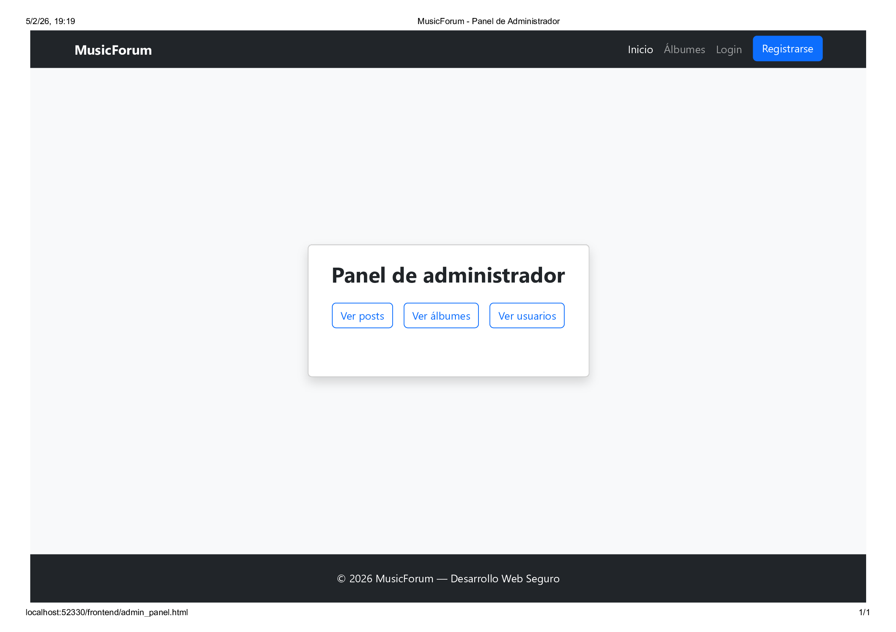
> Esta página sólo es accesible para el administrador de la página web. Desde ahí tendrá acceso a la página de consultar la lista de usuarios pudiendo editar según considere, ver los posts de la página web para editar según considere, y podrá ver los álbumes registrados en la base de datos de la web, desde donde podrá potencialmente borrar o crear entradas nuevas.

#### **12. Página Editar Perfil / Editar Perfil**
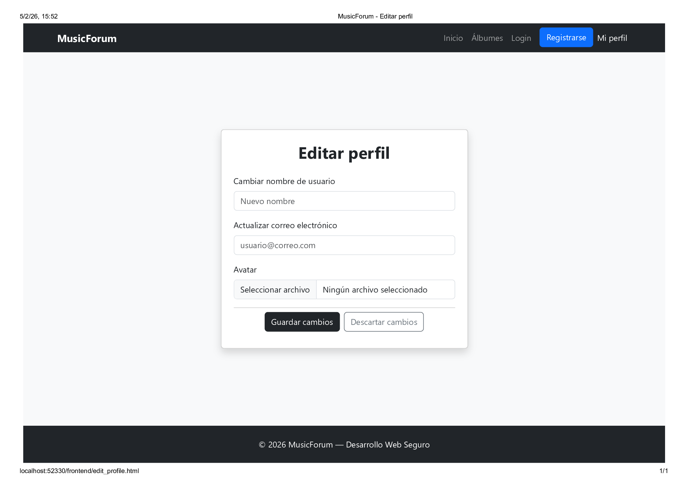
> Formulario para editar un perfil. Accesible para usuarios registrados para aplicarse en los mismos y para el administrador para aplicarlo en cualquier usuario.

#### **13. Página Editar Post / Editar Post**
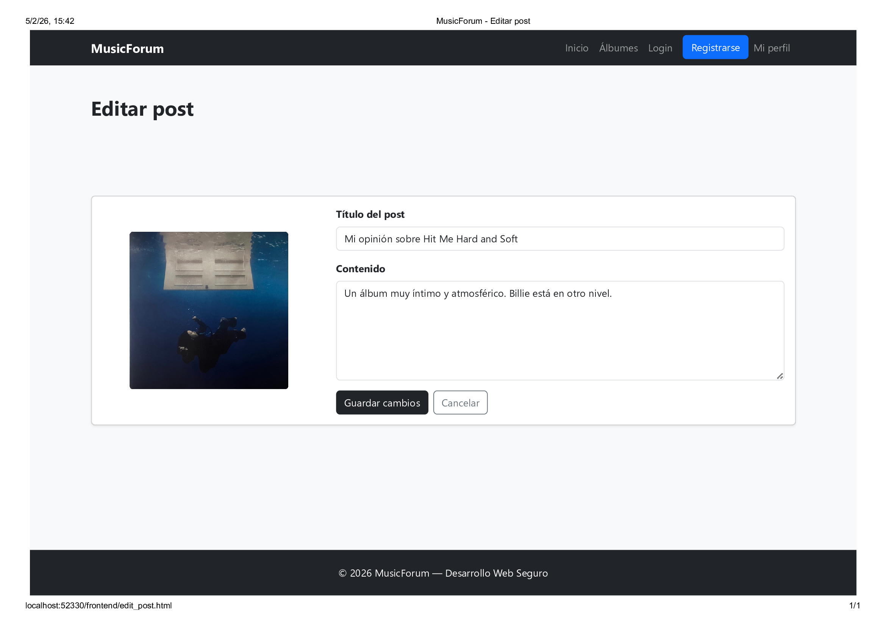
> Formulario para editar un post. Accesible para el admin para todos los posts o para un usuario para sus posts.

#### **14. Página Listado de Álbumes Admin View/ Listado de Álbumes Admin View**

> Esta página muestra los álbumes registrados en la página con la opción extra de añadir un álbum nuevo.

#### **15. Página Ver Posts Admin View/ Ver Posts Admin View**

> Esta página muestra los posts subidos a MusicForum. Se diferencia en el listado de usuarios anterior en que se tiene un botón para borrar los posts.


### **Participación de Miembros en la Práctica 1**

#### **Alumno 1 - [Carlos Moreno Cano]**

[Descripción de las tareas y responsabilidades principales del alumno en el proyecto]

| Nº    | Commits      | Files      |
|:------------: |:------------:| :------------:|
|1| [base spring boot project](https://github.com/DWS-2026/dws-2026-project-base/commit/6349ae93126f11e252194e108f988a737a92d18b)  | [backend/pom.xml](https://github.com/DWS-2026/dws-2026-project-base/commit/6349ae93126f11e252194e108f988a737a92d18b#diff-34049c3bc6deee4bbf269544338e0450399140da63fec684096d1ae0ce70b4bb)   |
|2| [Re-edit de un par de cosas del README.md que no se guardaron y adición de un html para listar los álbumes de la página.](https://github.com/DWS-2026/dws-2026-project-base/commit/8013174948aa74f31f7c35f91c6f4d8805d68c0)  | [frontend/album_listing.html](https://github.com/DWS-2026/dws-2026-project-base/commit/8013174948aa74f31f7c35f91c6f4d8805d68c07#diff-e351d6d4fb741c2abf7cfb206875171f1f882a578a8a2ebb668b8d670b438446)   |
|3| [new html file for post_listing and updated reference in the welcome page to it](https://github.com/DWS-2026/dws-2026-project-base/commit/a11e8d127f5ddbe71ca18388745fcb860973484d)  | [frontend/post_listing.html](https://github.com/DWS-2026/dws-2026-project-base/commit/a11e8d127f5ddbe71ca18388745fcb860973484d#diff-75e79d7dff23bd46c556b615c829d020f296b2239509e354df494a482ede3afc)   |
|4| [added admin_panel and some new pages. Those are still essentially empty: they only have the footer and the navbar. Will finish all this after lunch](https://github.com/DWS-2026/dws-2026-project-base/commit/8e9ad4d322605c8eb5fbd995c91cea52526e8d3f)  | [frontend/admin_panel.html](https://github.com/DWS-2026/dws-2026-project-base/commit/8e9ad4d322605c8eb5fbd995c91cea52526e8d3f#diff-a99ee44ee16ae8644114c00056148b725cc57c686ba3df37a838b381a0ce963d)   |
|5| [deleted a form because it wasn't needed. Improved the admin panel and user listing now works.](https://github.com/DWS-2026/dws-2026-project-base/commit/6b1d0763dd414e6269a978af40748fb689a2b578)  | [frontend/user_listing.html](https://github.com/DWS-2026/dws-2026-project-base/commit/6b1d0763dd414e6269a978af40748fb689a2b578#diff-67c12214d4fb8a3e0aafc2e40f622ab40600c9fa21e36f0f3881b77bae0ae67a)   |

---

---

#### **Alumno 2 - [Lorena López Gallego Casilda]**

[Descripción de las tareas y responsabilidades principales del alumno en el proyecto]

| Nº    | Commits      | Files      |
|:------------: |:------------:| :------------:|
|1| [Creación de la primera página de la web](https://github.com/DWS-2026/project-grupo-2/commit/882d7339dc0055b355ea5fe2004fc1e4f01ab56d)  | [first.html](frontend/first.html)   |
|2| [Creación página de registro y de login](https://github.com/DWS-2026/project-grupo-2/commit/525707113f232cb4544a3fc7ab17b779723df0c4)  | [register.html](frontend/register.html) [login.html](frontend/login.html)   |
|3| [Creación de las páginas de perfil de usuario y edición de ese perfil](https://github.com/DWS-2026/project-grupo-2/commit/0696a402720caaa5efa3d8651bcf25927291b5c4)  | [user_profile.html](frontend/user_profile.html) [edit_profile.html](frontend/edit_profile.html)   |
|4| [Posibilidad de "editar" los posts y de ver mis posts como usuario](https://github.com/DWS-2026/project-grupo-2/commit/5a633160d2c3ea7373aa83a84cfe078ed47f449f)  | [edit_post.html](frontend/edit_post.html) [user_posts.html](frontend/user_posts.html)   |
|5| [En las páginas de listado de posts y álbumes añadir botones especiales para el admin](https://github.com/DWS-2026/project-grupo-2/commit/50b478c1ed8a024232175f4b3b07ec61e704e09c)  | [album_listing.html](frontend/user_posts.html) [post_listing.html](frontend/post_listing.html)   |

#### **Alumno 3 - [Nombre Completo]**

[Descripción de las tareas y responsabilidades principales del alumno en el proyecto]

| Nº    | Commits      | Files      |
|:------------: |:------------:| :------------:|
|1| [Descripción commit 1](URL_commit_1)  | [Archivo1](URL_archivo_1)   |
|2| [Descripción commit 2](URL_commit_2)  | [Archivo2](URL_archivo_2)   |
|3| [Descripción commit 3](URL_commit_3)  | [Archivo3](URL_archivo_3)   |
|4| [Descripción commit 4](URL_commit_4)  | [Archivo4](URL_archivo_4)   |
|5| [Descripción commit 5](URL_commit_5)  | [Archivo5](URL_archivo_5)   |

---


## 🛠 **Práctica 2: Web con HTML generado en servidor**

### **Vídeo de Demostración**
📹 **[Enlace al vídeo en YouTube](https://www.youtube.com/watch?v=x91MPoITQ3I)**
> Vídeo mostrando las principales funcionalidades de la aplicación web.

### **Navegación y Capturas de Pantalla**

#### **Diagrama de Navegación**

Solo si ha cambiado.

#### **Capturas de Pantalla Actualizadas**

Solo si han cambiado.

### **Instrucciones de Ejecución**

#### **Requisitos Previos**
- **Java**: versión 21 o superior
- **Maven**: versión 3.8 o superior
- **MySQL**: versión 8.0 o superior
- **Git**: para clonar el repositorio

#### **Pasos para ejecutar la aplicación**

1. **Clonar el repositorio**
   ```bash
   git clone https://github.com/[usuario]/[nombre-repositorio].git
   cd [nombre-repositorio]
   ```

2. **AQUÍ INDICAR LO SIGUIENTES PASOS**

#### **Credenciales de prueba**
- **Usuario Admin**: usuario: `admin`, contraseña: `admin`
- **Usuario Registrado**: usuario: `user`, contraseña: `user`

### **Diagrama de Entidades de Base de Datos**

Diagrama mostrando las entidades, sus campos y relaciones:


> [Descripción opcional: Ej: "El diagrama muestra las 4 entidades principales: Usuario, Producto, Pedido y Categoría, con sus respectivos atributos y relaciones 1:N y N:M."]

### **Diagrama de Clases y Templates**

Diagrama de clases de la aplicación con diferenciación por colores o secciones:


> [Descripción opcional del diagrama y relaciones principales]

### **Participación de Miembros en la Práctica 2**

#### **Alumno 1 - [Nombre Completo]**

[Descripción de las tareas y responsabilidades principales del alumno en el proyecto]

| Nº    | Commits      | Files      |
|:------------: |:------------:| :------------:|
|1| [Descripción commit 1](URL_commit_1)  | [Archivo1](URL_archivo_1)   |
|2| [Descripción commit 2](URL_commit_2)  | [Archivo2](URL_archivo_2)   |
|3| [Descripción commit 3](URL_commit_3)  | [Archivo3](URL_archivo_3)   |
|4| [Descripción commit 4](URL_commit_4)  | [Archivo4](URL_archivo_4)   |
|5| [Descripción commit 5](URL_commit_5)  | [Archivo5](URL_archivo_5)   |

---

#### **Alumno 2 - [Nombre Completo]**

[Descripción de las tareas y responsabilidades principales del alumno en el proyecto]

| Nº    | Commits      | Files      |
|:------------: |:------------:| :------------:|
|1| [Descripción commit 1](URL_commit_1)  | [Archivo1](URL_archivo_1)   |
|2| [Descripción commit 2](URL_commit_2)  | [Archivo2](URL_archivo_2)   |
|3| [Descripción commit 3](URL_commit_3)  | [Archivo3](URL_archivo_3)   |
|4| [Descripción commit 4](URL_commit_4)  | [Archivo4](URL_archivo_4)   |
|5| [Descripción commit 5](URL_commit_5)  | [Archivo5](URL_archivo_5)   |

---

#### **Alumno 3 - [Nombre Completo]**

[Descripción de las tareas y responsabilidades principales del alumno en el proyecto]

| Nº    | Commits      | Files      |
|:------------: |:------------:| :------------:|
|1| [Descripción commit 1](URL_commit_1)  | [Archivo1](URL_archivo_1)   |
|2| [Descripción commit 2](URL_commit_2)  | [Archivo2](URL_archivo_2)   |
|3| [Descripción commit 3](URL_commit_3)  | [Archivo3](URL_archivo_3)   |
|4| [Descripción commit 4](URL_commit_4)  | [Archivo4](URL_archivo_4)   |
|5| [Descripción commit 5](URL_commit_5)  | [Archivo5](URL_archivo_5)   |

---

#### **Alumno 4 - [Nombre Completo]**

[Descripción de las tareas y responsabilidades principales del alumno en el proyecto]

| Nº    | Commits      | Files      |
|:------------: |:------------:| :------------:|
|1| [Descripción commit 1](URL_commit_1)  | [Archivo1](URL_archivo_1)   |
|2| [Descripción commit 2](URL_commit_2)  | [Archivo2](URL_archivo_2)   |
|3| [Descripción commit 3](URL_commit_3)  | [Archivo3](URL_archivo_3)   |
|4| [Descripción commit 4](URL_commit_4)  | [Archivo4](URL_archivo_4)   |
|5| [Descripción commit 5](URL_commit_5)  | [Archivo5](URL_archivo_5)   |

---

## 🛠 **Práctica 3: Incorporación de una API REST a la aplicación web, análisis de vulnerabilidades y contramedidas**

### **Vídeo de Demostración**
📹 **[Enlace al vídeo en YouTube](https://www.youtube.com/watch?v=x91MPoITQ3I)**
> Vídeo mostrando las principales funcionalidades de la aplicación web.

### **Documentación de la API REST**

#### **Especificación OpenAPI**
📄 **[Especificación OpenAPI (YAML)](/api-docs/api-docs.yaml)**

#### **Documentación HTML**
📖 **[Documentación API REST (HTML)](https://raw.githack.com/[usuario]/[repositorio]/main/api-docs/api-docs.html)**

> La documentación de la API REST se encuentra en la carpeta `/api-docs` del repositorio. Se ha generado automáticamente con SpringDoc a partir de las anotaciones en el código Java.

### **Diagrama de Clases y Templates Actualizado**

Diagrama actualizado incluyendo los @RestController y su relación con los @Service compartidos:


#### **Credenciales de Usuarios de Ejemplo**

| Rol | Usuario | Contraseña |
|:---|:---|:---|
| Administrador | admin | admin123 |
| Usuario Registrado | user1 | user123 |
| Usuario Registrado | user2 | user123 |

### **Participación de Miembros en la Práctica 3**

#### **Alumno 1 - [Nombre Completo]**

[Descripción de las tareas y responsabilidades principales del alumno en el proyecto]

| Nº    | Commits      | Files      |
|:------------: |:------------:| :------------:|
|1| [Descripción commit 1](URL_commit_1)  | [Archivo1](URL_archivo_1)   |
|2| [Descripción commit 2](URL_commit_2)  | [Archivo2](URL_archivo_2)   |
|3| [Descripción commit 3](URL_commit_3)  | [Archivo3](URL_archivo_3)   |
|4| [Descripción commit 4](URL_commit_4)  | [Archivo4](URL_archivo_4)   |
|5| [Descripción commit 5](URL_commit_5)  | [Archivo5](URL_archivo_5)   |

---

#### **Alumno 2 - [Nombre Completo]**

[Descripción de las tareas y responsabilidades principales del alumno en el proyecto]

| Nº    | Commits      | Files      |
|:------------: |:------------:| :------------:|
|1| [Descripción commit 1](URL_commit_1)  | [Archivo1](URL_archivo_1)   |
|2| [Descripción commit 2](URL_commit_2)  | [Archivo2](URL_archivo_2)   |
|3| [Descripción commit 3](URL_commit_3)  | [Archivo3](URL_archivo_3)   |
|4| [Descripción commit 4](URL_commit_4)  | [Archivo4](URL_archivo_4)   |
|5| [Descripción commit 5](URL_commit_5)  | [Archivo5](URL_archivo_5)   |

---

#### **Alumno 3 - [Nombre Completo]**

[Descripción de las tareas y responsabilidades principales del alumno en el proyecto]

| Nº    | Commits      | Files      |
|:------------: |:------------:| :------------:|
|1| [Descripción commit 1](URL_commit_1)  | [Archivo1](URL_archivo_1)   |
|2| [Descripción commit 2](URL_commit_2)  | [Archivo2](URL_archivo_2)   |
|3| [Descripción commit 3](URL_commit_3)  | [Archivo3](URL_archivo_3)   |
|4| [Descripción commit 4](URL_commit_4)  | [Archivo4](URL_archivo_4)   |
|5| [Descripción commit 5](URL_commit_5)  | [Archivo5](URL_archivo_5)   |

---

#### **Alumno 4 - [Nombre Completo]**

[Descripción de las tareas y responsabilidades principales del alumno en el proyecto]

| Nº    | Commits      | Files      |
|:------------: |:------------:| :------------:|
|1| [Descripción commit 1](URL_commit_1)  | [Archivo1](URL_archivo_1)   |
|2| [Descripción commit 2](URL_commit_2)  | [Archivo2](URL_archivo_2)   |
|3| [Descripción commit 3](URL_commit_3)  | [Archivo3](URL_archivo_3)   |
|4| [Descripción commit 4](URL_commit_4)  | [Archivo4](URL_archivo_4)   |
|5| [Descripción commit 5](URL_commit_5)  | [Archivo5](URL_archivo_5)   |
